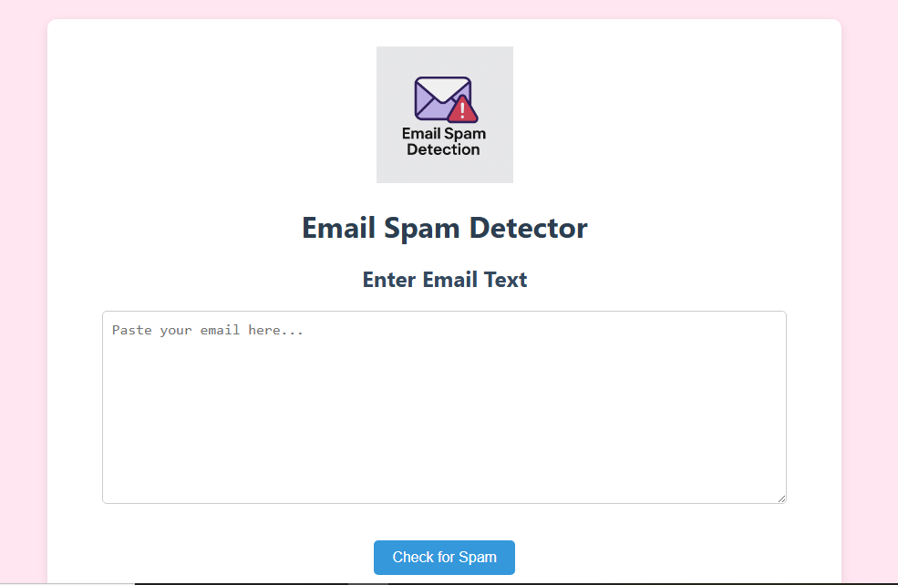
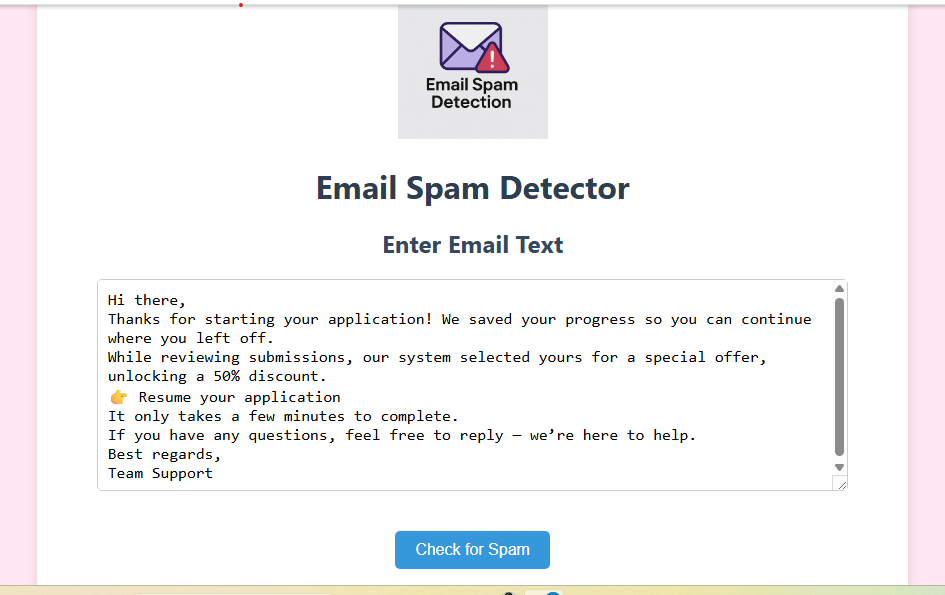
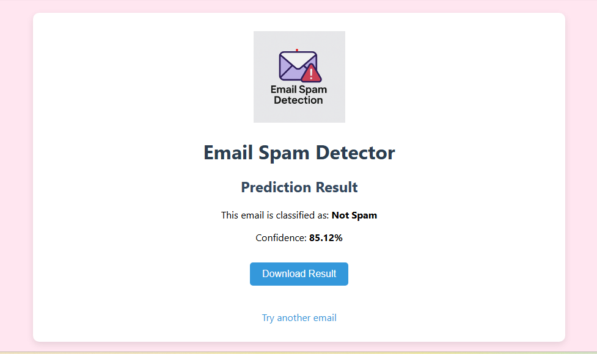
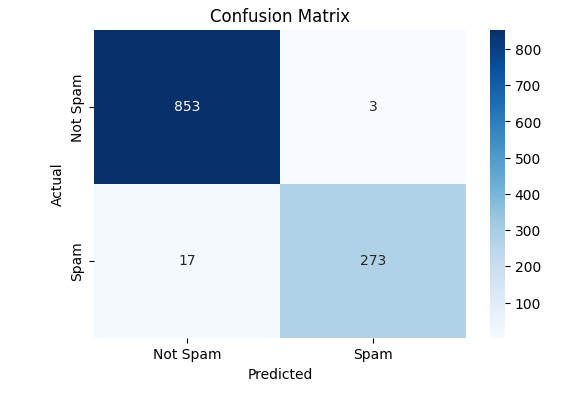
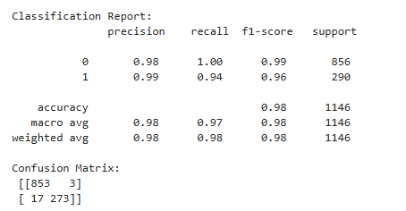

# Email Spam Detection Web App

An end-to-end machine learning application that classifies emails as **Spam** or **Not Spam** using Natural Language Processing (NLP). The solution is deployed as an interactive web application, enabling real-time predictions through a simple user interface.

---

## Table of Contents

- [Project Overview](#project-overview)
- [Business Problem](#business-problem)
- [Dataset Description](#dataset-description)
- [Methodology](#methodology)
- [Model Development](#model-development)
- [Model Evaluation](#model-evaluation)
- [Web App Deployment](#web-app-deployment)
- [Application Preview](#application-preview)
- [Accessing the Application](#accessing-the-application)
- [Tools & Technologies](#tools--technologies)

---

## Project Overview

This project demonstrates the development and deployment of a machine learning model for spam email classification. It covers the full AI lifecycle, including data preprocessing, feature engineering, model training, evaluation, and deployment via a Flask web application.

The system allows users to input email text and receive instant predictions along with confidence scores.

---

## Business Problem

Spam emails pose significant challenges in communication systems by cluttering inboxes, wasting time, and potentially exposing users to malicious content.

The objective of this project is to build a predictive system that can automatically classify emails as spam or not spam, improving efficiency and supporting automated decision-making.

---

## Dataset Description

- **Source:** Kaggle Email Spam Dataset  
- **Total Records:** ~5,728 emails  
- **Target Variable:**  
  - `1 = Spam`  
  - `0 = Not Spam`  

The dataset is slightly imbalanced, with more non-spam emails than spam, which was considered during model evaluation.

---

## Methodology

### Data Preparation
- Cleaned text data (removed punctuation, digits, extra spaces)
- Normalized text (lowercasing, whitespace handling)

### Feature Engineering
- Converted text into numerical features using **TF-IDF Vectorization**

### Data Splitting
- Train/Test split: **80/20**

---

## Model Development

- Built a machine learning pipeline using:
  - `TfidfVectorizer`
  - `Multinomial Naive Bayes`
- Applied **GridSearchCV** for hyperparameter tuning
- Selected the best parameters based on cross-validation performance

---

## 📈 Model Evaluation

- The model was evaluated using: Accuracy, Precision, Recall, F1-score and Confusion Matrix
- Achieved **98% accuracy with strong precision and recall**, ensuring reliable spam detection performance  
- High recall (~94%) for spam detection  
- Minimal false positives and false negatives  

---

## Web App Deployment

The trained model was deployed using **Flask** to create an interactive web application.

### Key Features:
- User input form for email text  
- Real-time prediction (Spam / Not Spam)  
- Confidence score display  
- Downloadable prediction result  

### Deployment Platform:
- Hosted on **Render**

---

## Application Preview

### 🔹 Home Page


### 🔹 Input Example


### 🔹 Prediction Result


### 🔹 Confusion Matrix


### Classification Report


---

## Accessing the Application

- **Live Demo:** [Open Web App](https://email-spam-detector-t80r.onrender.com)  
- **Project Repository:** *(this repo)*  

To run locally:

```bash
git clone https://github.com/Peace718/email-spam-detector.git
cd email-spam-detector
pip install -r requirements.txt
python app.py

